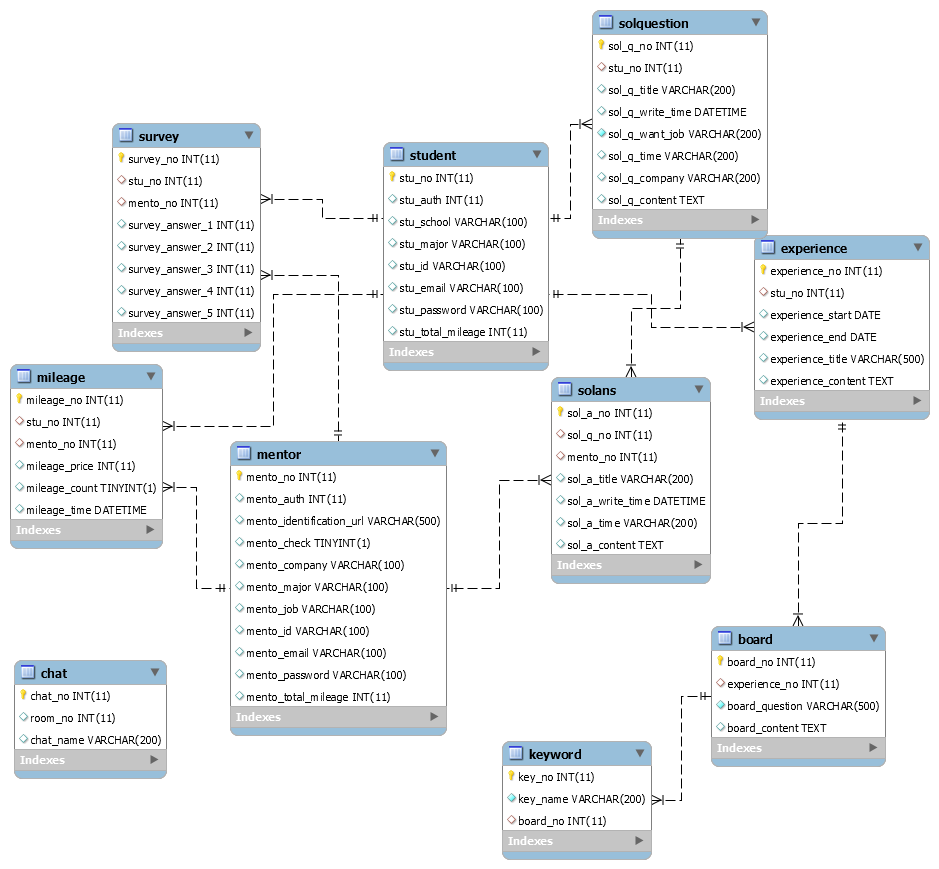

# 자가분석 취업 플랫폼

자소서 분석 및 멘토링 서비스를 통한 자가분석 서비스

### 주제 선정 배경

- 코로나19로 인해 채용 시장이 현저히 줄어들고, AI 면접, 화상 면접 등 비대면 방식의 채용 과정이 늘고 있는 추세
- 구직자와 현직자 1:1 매칭을 통해 기업에 대한 정보를 얻을 수 있고 언택트 프로세스에 적응할 수 있는 서비스 제공

### 서비스 목표

- 현직자와 온라인 채팅 & 화상 인터뷰 서비스 제공
  - 우수 멘토 리워드 제공
- 구직자가 자신의 경험을 정리할 수 있는 공간을 제공
  - 키워드 별 정리
  - 연대기 작성
- 자소서 항목에서 키워드를 뽑아 그에 맞는 경험을 추천하여 자소서 작성에 도움을 주는 서비스 제공

### 개발 언어 및 활용 기술

- Java Spring Boot - 백엔드
- Swagger - 백엔드 API
- MySQL - DB
- WebRTC - 화상채팅 웹 클라이언트
- Python - 데이터 분석
- React - 프론트엔드
- MaterialUI - React UI 프레임워크
- Firebase - 회원가입 및 관리, 푸시 알람

### ERD

### 화면 예시

https://ovenapp.io/view/1mcbsPtgJYhj2PLbjGQT6zQY19CNXMDP/KzEmI

채팅화면

경험 정리

